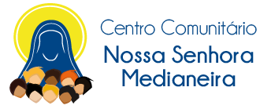

## Projeto: Site para o Centro Comunitário Nossa Senhora Medianeira.

**Disponível em:** [http://ccnmedianeiras.herokuapp.com/](http://ccnmedianeiras.herokuapp.com/)

Localizado em Fortaleza, o Centro Comunitário Nossa Senhora Medianeira pertence à Paróquia Nossa Senhora das Dores (Otávio Bonfim) onde crianças, adolescentes, jovens e mulheres que moram nas comunidades carentes da Paróquia e bairros adjacentes participam ativamente.

**O site desenvolvido tem como intenção oferecer facilidade e praticidade às atividades desenvolvidas pela administração do Centro, tais como:** 
## Cadastro
Como foi estudado nas visitas, o cadastro (tanto de alunos quanto de voluntários) é bem manual, e tudo através de papéis, guardado de forma física. Pensando nisso, agora as informações ficarão concentradas em um sistema próprio do Centro, que abrange o cadastro de:
* **Pessoas (Alunos)**: Todas as pessoas que participam, de alguma forma, poderão ser cadastradas. Também é informado há quanto tempo essa pessoa está no Centro.
* **Voluntários**: Todos os voluntários possuem cadastro. Também é guardado a informação se a pessoa está ou não em atividade no Centro atualmente.
* **Atividades**: Todas as atividades desenvolvidas no Centro agora possuem um cadastro. Através disso, é mostrado no site principal quais atividades estão disponíveis para inscrição atualmente, assim como o número de vagas, o professor, o horário e o local; proporcionando, assim, uma informação centralizada para todos os interessados (pessoas que desejam se inscrever e responsáveis pelas atividades).
## Eventos
Para gerar interesse do público externo e entreter os que já fazem parte, eventos são constantemente promovidos no Centro pelas    responsáveis ou até mesmo pelos parceiros. Com isso em mente, agora é possível cadastrar esses eventos no sistema e vê-los na página principal do site, dispostos por ordem futura de acontecimento no mês atual.
   
## Páginas do site principal 
- [**Sobre nós**](http://ccnmedianeiras.herokuapp.com/sobre) - informações sobre o centro comunitário, história, fotos, equipe...
- [**Eventos**](http://ccnmedianeiras.herokuapp.com/eventos/info) - próximos eventos que irão acontecer no Centro.
- [**Atividades**](http://ccnmedianeiras.herokuapp.com/atividades/info) - informações sobre as atividades oferecidas pelo Centro, assim como a lotação atual, o professor, dia e hora.
- [**Projetos**](http://ccnmedianeiras.herokuapp.com/projetos) - informações sobre os projetos (internos e dos parceiros).
